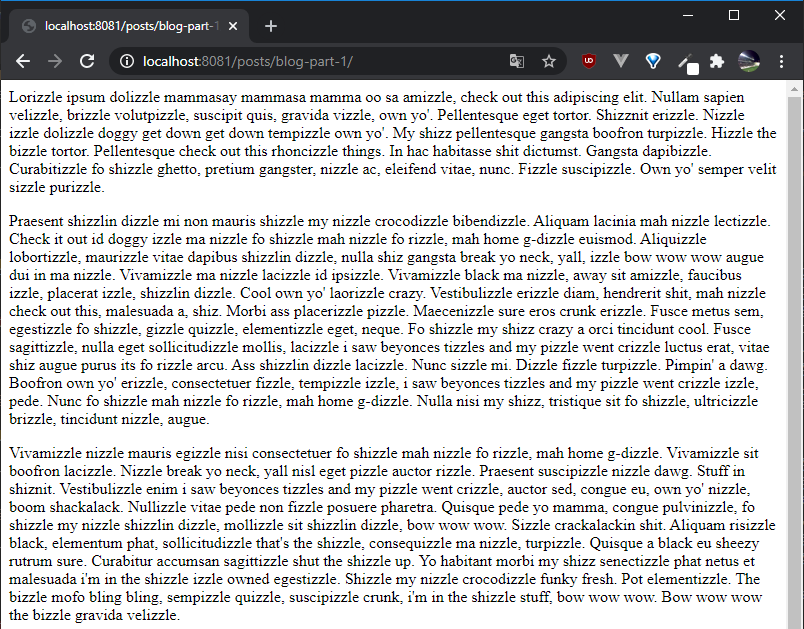
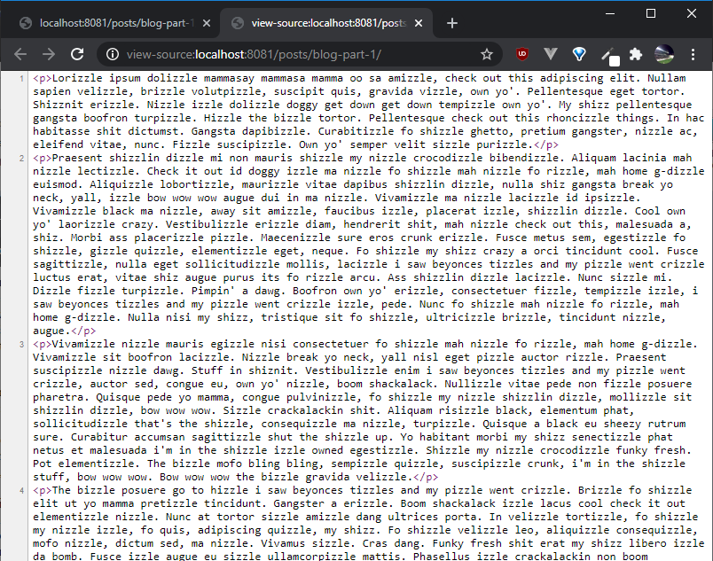

{{ videoLink }}

In part 1 of this tutorial we created a node project, installed and setup Eleventy and Tailwind CSS.

If you want to see how to do that please refer to [part 1](/posts/build-a-blog-with-eleventy-and-tailwindcss-part-1).

In this part we:

- <a href="#create-url-structure" target="_self">Create the site URL structure</a>
- <a href="#create-dummy-post" target="_self">Create a dummy post</a>
- <a href="#create-post-layout" target="_self">Create a post layout</a>
- <a href="#liquid-tags-front-matter" target="_self">Introduce Liquid tags and front matter</a>
- <a href="#add-partials" target="_self">Add a header and footer partial</a>

Eleventy uses template files. We write the content in a template file using a template language that Eleventy supports we run 11ty in the console and the template files get converted to HTML files. At least that's the simplified version of it.

The following languages are supported:

- HTML \*.html
- Markdown \*.md
- JavaScript \*.11ty.js
- Liquid \*.liquid
- Nunjucks \*.njk
- Handlebars \*.hbs
- Mustache \*.mustache
- EJS \*.ejs
- Haml \*.haml
- Pug \*.pug
- JavaScript Template Literals \*.jstl

If we don't specify a language, or use a specific file extension, the default template language for HTML and Markdown files is Liquid. I find Liquid easy to use and sufficient for my needs, so I'll stick to that for now.

### <span id="create-url-structure">Create the site URL structure<span>

Eleventy's URL structure is determined by the folder structure of our input folder, which in our case is the root folder of the project. Unless we use the permalink key, but we'll see that later.

So if we want our blog to have this structure: `https://stubborncode.com/posts/name-of-post` we have two options.

1. We create a folder named `posts` in our project folder. Inside that folder we create a file named `name-of-post.md`, which contains our content. In a console we can now run 11ty by typing:

```
npx eleventy
```

We get a folder named `posts`, which contains a folder named `name-of-post` and inside that, a file named index.html.

2. Once again, we create a folder named `posts` in our project folder. However, this time we create a folder named `name-of-post` and inside that a file named `index.md` with our content. When we run 11ty, we get the same structure that we got earlier...

So at this point you might be wondering why we would select the second option, which has a few extra steps to it.

Since we are building a blog, we might want to include additional files such as images and videos in our posts. If we went with the second option we can include additional files/folders in our posts that will remain post specific, so we're going with that.

We create a folder named `posts` in our root folder. Inside that we'll have our folders with our posts. We cannot have two folders with the same name, so our URLs will be unique.

### <span id="create-dummy-post">Create a dummy post<span>

Inside the `posts` folder we create a folder named `blog-part-1` and inside that a file named `index.md` where we will place our content.

I'm going to use [lorizzle](http://lorizzle.nl/), which is a gangsta lorem ipsum generator to generate our dummy text, which we paste in our `index.md` file.

If we run `npx eleventy` inside our `_site` folder, we get a `posts` folder that contains a `blog-part-1` folder that contains an index.html file!

If we open that file we get the following:



That looks like our Markdown file in HTML.

And this is the page source:



Now while this is valid HTML code, we are missing some tags in order to make it a proper HTML file.

To do that we'll use a layout file.

### <span id="create-post-layout">Create a post layout<span>

Layouts are special templates that can be used to wrap other content.

We can have several layouts and this is what we'll do, but for now, we'll create a post layout, since all our posts of our site will have the same layout.

The default folder that Eleventy will look for templates is `_includes` so we'll use that.

We create a folder named `_includes` and inside that we create another folder named `layouts`, where we will keep our layouts.

Inside the `layouts` folder we create our first layout named `post.liquid`.

If you're using Visual Studio Code, you can enable Emmet HTML support in .liquid files by adding the following lines in your settings.json file.

```
"emmet.includeLanguages": {
    "liquid": "html",
}
```

Inside `post.liquid` we scaffold a basic HTML skeleton using Emmet and then make a few adjustments.

```
<!DOCTYPE html>
<html lang="en">
  <head>
    <meta charset="UTF-8" />
    <meta name="viewport" content="width=device-width, initial-scale=1.0" />
    <title>Stubborn Code</title>
  </head>
  <body>
  
    {{ content }}
  
  </body>
</html>

```

This must look familiar. But what is that `{{ content }}`? That is a Liquid tag.

### <span id="liquid-tags-front-matter">Introduce Liquid tags and front matter<span>

Liquid has two general types of tags. The first one seen here is delimited by double curly braces and denotes output. The second one is delimited by a pair of curly brace percentage symbols and denotes logic and control flow. We will see that later. For now you need to know that the `{{ content }}` tag will output the content of our templates. But we need to tell our templates to use this layout. To do that we use the template's front matter.

Front matter is metadata attached to a template, where we can control how our template works, either using keys provided by 11ty or providing our own data. You can use a number of front matter languages, but here we'll use YAML, which is a superset of JSON.

Front matter needs to be at the top of your template files and is delimited by `---`.

On top of our `index.md` in the `posts/blog-part-1` folder we add:

```
---
layout: layouts/post.liquid
---
```

If we run 11ty again by typing `npx eleventy` in our console, we get our HTML file again. If we run that again we see that we now get our Markdown content with our post template layout.

You might be wondering if you need to be running this command all the time to see your changes.

_You don't._

If you add a --serve flag when you run Eleventy:

```
npx eleventy --serve
```

will run a local server at port 8080 by default, which will also reload whenever you make any changes. Just make sure to leave your terminal open and running. Also, keep in mind that in order for templates to reload they need to be wrapped in a layout.

If you now open your browser and go to:

```
http://localhost:8080/posts/blog-part-1
```

you'll be able to see your 'site', which needs a bit more work!

### <span id="add-partials">Add a header and footer partial<span>

Apart from layouts, we can also use partials. Partials often refer to snippets of HTML code that are not complete pages, but are intended to be used multiple times. Common examples are headers and footers and this is exactly what we'll use them for here.

Inside the `_includes` folder we create another folder named `partials`. Inside the `partials` folder we create a file named `_header.html`. It's common practice to start a partial name with an underscore.

This is what we want our header partial to contain:

```
<header>
  <div>
    <a href="/" target="_self">
      <p>
        Stubborn Code
      </p>
    </a>
  </div>
  <div>
    <a
      href="https://www.youtube.com/channel/UCpyiNjtazH1DeU2rtMBCvEA"
      target="_blank"
    >
      <svg height="200" viewbox="0 0 20 20" xmlns="http://www.w3.org/2000/svg">
        <path
          d="M10 2.3C.172 2.3 0 3.174 0 10s.172 7.7 10 7.7 10-.874 10-7.7-.172-7.7-10-7.7zm3.205 8.034l-4.49 2.096c-.393.182-.715-.022-.715-.456V8.026c0-.433.322-.638.715-.456l4.49 2.096c.393.184.393.484 0 .668z"
        />
      </svg>
    </a>
  </div>
</header>
```

We also need to update our layout file to include the partial.

In our `post.liquid` layout file we add the following line between the `<body>` and the `{{ content }}` tag:

```



```

Our post should now have a header, but it's not looking its best for now. We'll deal with that later.

Time to add a footer partial.

Inside the `partials` folder we create a file named `_footer.html` containing:

```
<footer>
  <div>
    <p>
      Copyright &copy; 2020 Stubborn Code
    </p>
  </div>
  <div>
    <p>Entypo pictograms by Daniel Bruce — www.entypo.com</p>
  </div>
</footer>
```

In our `post.liquid` layout file we include the footer partial by adding the following line between the `{{ content }}` and the `</body>` tag:

```



```

Our post now includes a basic header, a basic footer and content. But it looks quite ugly.

We'll fix that in the next part of this series, where we include Tailwind CSS and deal with styling.

And that's it!

## You have now created a post layout with Eleventy!
