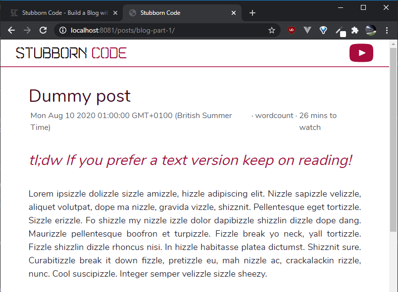

{{ videoLink }}

In the previous part of this tutorial we created the post layout and added header and footer partials. In this one we make them look better.

If you want to see what we've done until now, please refer to [part 1](/posts/build-a-blog-with-eleventy-and-tailwindcss-part-1) and [2](/posts/build-a-blog-with-eleventy-and-tailwindcss-part-2).

In this tutorial we:

- <a href="#talk-briefly-about-tailwindcss" target="_self">Talk briefly about utility classes and TailwindCSS</a>
- <a href="#extend-tailwindcss-color-palette" target="_self">Extend the TailwindCSS default color palette</a>
- <a href="#add-custom-fonts" target="_self">Add custom fonts</a>
- <a href="#style-header-partial" target="_self">Style the header partial</a>
- <a href="#style-footer-partial" target="_self">Style the footer partial</a>
- <a href="#style-markdown-content" target="_self">Style the markdown content</a>

_Whenever you see the '\$' symbol in front of a command, it's a terminal command._

### <span id="talk-briefly-about-tailwindcss">Talk briefly about utility classes and TailwindCSS<span>

Utility classes in CSS are classes that serve a specific purpose and their name usually resembles their operation. A utility-first framework does not include fully-fledged components such as navigation bars, cards and modals. Instead, it has a vast number of utility classes, which allow you to easily build your own custom components.

You can see all the available classes in the [TailwindCSS documentation](https://tailwindcss.com/docs/), but I'll try and explain the core concepts and most commonly used classes as we go along.

### <span id="extend-tailwindcss-color-palette">Extend the TailwindCSS default color palette<span>

While TailwindCSS includes a huge number of classes, you might still want to customize it. In our case, we want to add two brand colors, include two custom fonts, and add a custom media query breakpoint.

The way we extend our theme is by modifying the `tailwind.config.js` file that TailwindCSS created for us when we initialized it in part 1.

The `tailwind.config.js` file is in the root of our project folder and if you haven't modified it, should contain the following:

```
module.exports = {
  purge: [],
  theme: {
    extend: {},
  },
  variants: {},
  plugins: [],
}
```

There are two main ways to customize the default theme. We can override the default classes by adding objects directly inside the `theme` object, or extend the theme by adding extra classes by placing key-value pairs inside the `extend` object. Here, we will go with the latter.

Tailwind CSS has a broad range of colors in its [default palette](https://tailwindcss.com/docs/customizing-colors/#default-color-palette). By default they are shared by the textColor, borderColor and backgroundColor utilities.

Apart from black and white, which have exactly one color, the rest of its colors come with a modifier ranging from 100 to 900. 100 is the lightest shade of the color and 900 is the darkest.

We want to add two shades of pink/purple that are close to the branding of the Stubborn Code YouTube channel. The new `tailwind.config.js` file is:

```
module.exports = {
  purge: [],
  theme: {
    extend: {
      colors: {
        brand: {
          light: "#a70c3d",
          dark: "#48051a",
        }
      },
    },
  },
  variants: {},
  plugins: [],
}
```

The way we use the textColor utility is by adding a class that has this form:

```
.text-color-modifier
```

So to use our two new colors to color our text we can use the following classes:

```
.text-brand-light
.text-brand-dark
```

We can also declare the `default` modifier in the `tailwind.config.js` file and use one `text-brand` class with, and one `text-brand` class without a modifier inside our markup, but I'm using both light and dark modifiers in order to be more explicit.

### <span id="add-custom-fonts">Add custom fonts<span>

The two fonts that we're using are [Nunito](https://fonts.google.com/specimen/Nunito) and [Marske](https://www.behance.net/gallery/21677209/Marske-FREE-FONT), which are both free to use.

When you download the fonts, you'll notice that they're either in .ttf or .otf format. While these work just fine and provide good browser compatibility, I prefer to use .woff2 or .woff fonts since they offer great compression levels. While .woff2 fonts offer, on average, a 30% reduction in file size, they don't have the wide support that .woff fonts do, so what I like to do is use .woff2 fonts, but include .woff fonts as a fallback option. Also if you want to support Internet Explorer 8 or below, you shouldn't use either...

You can use any file converter to convert your fonts to your desired format. I used [cloudconvert](https://cloudconvert.com/).

We now have our Nunito and Marske fonts in .woff and .woff2 formats.

There are a few steps we need to take before we're able to use our fonts.

Once again we need to extend the default theme of Tailwind. More specifically the `fontFamily` object.

Since we want to use 'Nunito' as our default font, we can modify Tailwind's default font family, which is the sans family. However, since the default theme is using an array of font families we need to tell the configuration to add 'Nunito', but also preserve the default ones as fallback fonts.

On top of our `tailwind.config.js` file we add the following line:

```
const defaultTheme = require("tailwindcss/defaultTheme");
```

This loads the default theme's values and saves them in the `defaultTheme` variable. We can now update the file as follows:

```
const defaultTheme = require("tailwindcss/defaultTheme");

module.exports = {
  purge: [],
  theme: {
    extend: {
      colors: {
        brand: {
          light: "#a70c3d",
          dark: "#48051a",
        }
      },
      fontFamily: {
        sans: ["Nunito", ...defaultTheme.fontFamily.sans],
        brand: ["Marske", ...defaultTheme.fontFamily.sans],
      },
    },
  },
  variants: {},
  plugins: [],
}
```

The line:

```
sans: ["Nunito", ...defaultTheme.fontFamily.sans],
```

is using the spread(...) operator. defaultTheme.fontFamily.sans contains an array with the theme's default sans font families. Here we define a new array that has 'Nunito' at index 0. The spread operator expands the values of the old array and appends them to the new array. The 'brand' font family didn't exist so we can define that freely without overwriting anything, but we still include the sans font family as a fallback.

We have now told Tailwind to create classes that contain our fonts, but we haven't actually loaded our fonts.

In the 'css' folder that we created in part 1 of the tutorial, create a folder named 'fonts' and copy both .woff and .woff2 versions of our fonts.

The folder should now contain the following files or similar:

```
Marske.woff
Marske.woff2
Nunito-Regular.woff
Nunito-Regular.woff2
```

Remember that we are using Eleventy, so our output folder is `_site`. By default, 11ty will not copy .woff and .woff2 from our input to our output folder. We could tell 11ty to copy the specific file formats, but in this case, I think it is easier to just have 11ty copy the specific folder. It is also faster, as Eleventy doesn't need to scan the entire project directory.

We create an `.eleventy.js` file in the root of our project. Inside that, we can either export an object or a function. Exporting a function allows for further customization using a number of helper methods, so we'll go with that.

Our `.eleventy.js` file should now contain:

```
module.exports = function (eleventyConfig) {
  // Copy `css/fonts/` to `_site/css/fonts`
  eleventyConfig.addPassthroughCopy("css/fonts");
};

```

Passthrough file copy entries are relative to the root of your project and not the Eleventy input folder. Since we didn't specify a different input directory, it doesn't make a difference here, but it's just something to keep in mind.

11ty will now copy our fonts to the output directory.

Last step is to include our font files in our CSS. We do that in the `tailwind.css` file that is located in the 'css' folder in the root of our project.

That file should now contain the following:

```
@tailwind base;
@tailwind components;
@tailwind utilities;
```

In order to avoid specificity issues, we add any custom styles, including our custom fonts, between `@tailwind base;` and `@tailwind components;`.

We update the file accordingly:

```
@tailwind base;

@font-face {
  font-family: "Marske";
  src: local("Marske"),
       url("/css/fonts/Marske.woff2") format("woff2"),
       url("/css/fonts/Marske.woff") format("woff");
}

@font-face {
  font-family: "Nunito";
  src: local("Nunito"),
       url("/css/fonts/Nunito-Regular.woff2") format("woff2"),
       url("/css/fonts/Nunito-Regular.woff") format("woff");

@tailwind components;
@tailwind utilities;
```

The @font-face CSS at-rule specifies a custom font. The font can either be loaded from a server or locally. Using both the `local()` and `url()` we can look for the font name on the user's computer. If a version of the font is found locally, that is used. Otherwise the .woff2 version that we specified is downloaded. Lastly, if the browser doesn't support .woff2 fonts, the .woff version is downloaded and used.

Since all our setup is ready, we can now run the following in our console after we `cd` into the root of our project:

```
$ npm run build
$ npx eleventy --serve
```

The first line builds our Tailwind CSS file with our custom additions included, and the second one runs Eleventy and keeps watching for file changes, so you should leave your terminal open.

We are now ready to start styling our blog!

### <span id="style-header-partial">Style the header partial<span>

This is how our post looks like now:


Before we start styling the header partial, it would help if we could see the changes. Since we are working with the post layout, we can include our CSS in the `post.liquid` file that is located in `_includes\layouts` by adding the following line inside the `<head>` tag:

```
<link href="/css/tailwind.css" rel="stylesheet"/>
```

After we add the above line, our post looks like this:


When we included the `@tailwind base;` directive in our CSS file we told Tailwind to inject its base styles. This set of base styles is called Preflight and is built on top of `normalize.css`. Among other things, it removes the default margins, headings and lists are unstyled, etc. That means that after we style our header and footer, we need to style our main content as well! But, we'll deal with that later.

We want our header to be a simple navbar with our logo on the left and an SVG that links to the Stubborn Code YouTube channel on the right.

This is what our `_header.html` partial file looks like at the moment:

```
<header>
  <div>
    <a href="/" target="_self">
      <p>
        Stubborn Code
      </p>
    </a>
  </div>
  <div>
    <a
      href="https://www.youtube.com/channel/UCpyiNjtazH1DeU2rtMBCvEA"
      target="_blank"
    >
      <svg height="200" viewbox="0 0 20 20" xmlns="http://www.w3.org/2000/svg">
        <path
          d="M10 2.3C.172 2.3 0 3.174 0 10s.172 7.7 10 7.7 10-.874 10-7.7-.172-7.7-10-7.7zm3.205 8.034l-4.49 2.096c-.393.182-.715-.022-.715-.456V8.026c0-.433.322-.638.715-.456l4.49 2.096c.393.184.393.484 0 .668z"
        />
      </svg>
    </a>
  </div>
</header>
```

We will convert our `<header>` tag into a flex container.

We add the following classes to the `<header>` tag:

```
<header class="flex items-center justify-between">
```

During the first introduction of Tailwind classes I will include their equivalent CSS properties as below.

```
Class            --> Property

.flex            --> display: flex;
.items-center    --> align-items: center;
.justify-between --> justify-content: space-between;
```

Our header has now our logo on the far left, our YouTube link on the far right, both centered vertically and looks like this:


Next thing we want is to add some padding and a bottom border, so it's probably a good time to talk about how Tailwind deals with spacing.

The default spacing scale goes from 0 to 256px/16rem. One spacing unit is 4px or 0.25rem and values are proportional. This means that a value of 8 which gives us 32px/2rem is twice the spacing that 4 gives us, which is 16px/1rem.

The spacing scale is used for paddings, margins, height and width attributes to name a few.

For a horizontal padding of 2rem we can use:

```
Class --> Property

.px-8 --> padding: 0 2rem;
```

`p` for padding, `x` for the x axis and `8` for our spacing value.

In order to add our bottom border we add the following classes:

```
Class               --> Property

.border-b-2         --> border-bottom-width: 2px;
.border-brand-light --> border-color: rgba(167, 12, 61, var(--border-opacity));
.border-opacity-75  --> --border-opacity: 0.75;
```

The `.border-brand-light` class sets our border's color to the custom brand light color we defined earlier.

Our `<header>` tag now looks like this:

```
<header class="flex items-center justify-between px-8 border-b-2 border-brand-light border-opacity-75">
```

And our actual header like this:


We want our logo to have the custom font that we defined earlier so we add the following:

```
Class       --> Property

.font-brand --> font-family: Marske, system-ui, -apple-system, BlinkMacSystemFont, "Segoe UI", Roboto, "Helvetica Neue", Arial, "Noto Sans", sans-serif, "Apple Color Emoji", "Segoe UI Emoji", "Segoe UI Symbol", "Noto Color Emoji";
}
```

We also want the 'Code' part of the logo to have our brand light color, so we wrap that in a `<span>` tag and add this class to it:

```
Class              --> Property

.text-brand-light  --> color: rgba(167, 12, 61, var(--text-opacity));
```

We want to increase our logo's size but we also want it to change according to the screen size, so now is a good time to talk about Tailwind's breakpoints.

Tailwind's breakpoints are basically CSS media queries and by default are the following:

```
'sm': '640px',
// => @media (min-width: 640px) { ... }

'md': '768px',
// => @media (min-width: 768px) { ... }

'lg': '1024px',
// => @media (min-width: 1024px) { ... }

'xl': '1280px',
// => @media (min-width: 1280px) { ... }
```

We can also add our own, which is something that we'll do later on. As you might have noticed these breakpoints are min-width, which means that if you specify a class for a breakpoint that class will come into effect for resolutions that match the breakpoint and higher. You can also specify max-width breakpoints, but we won't do this in this series.

We use these as a prefix modifier in front of the class that we want to use. So we add the following classes to the `<p>` tag that holds our logo:

```
Class         --> Property

.text-3xl     --> font-size: 1.875rem;
.sm:text-4xl  --> font-size: 2.25rem;
```

resulting to:

```
<p class="font-brand text-3xl sm:text-4xl">
```

Since we didn't specify a breakpoint for the first font size, we are getting a font size of 1.875rem for resolutions less than `640px`. For resolutions higher than that, we get the bigger font size of 2.25rem.

Our header now looks like this and our logo is exactly as we want it:


Only thing left in our header is the YouTube link.

We remove the `height` attribute from the SVG and add the following class to specify the height in that way:

```
Class --> Property

.h-12 --> height: 3rem;
```

In order to specify the color of an SVG element, we can combine two classes, `.fill-current` and `text-color`.

In our case we add the following:

```
Class             --> Property

.fill-current	  --> fill: currentColor;
.text-brand-light --> color: rgba(167, 12, 61, var(--text-opacity));
```

And the YouTube SVG icon gets our custom brand color.

This is what the `_header.html` partial file looks like now:

```
<header
  class="flex items-center justify-between px-8 border-b-2 border-brand-light border-opacity-75"
>
  <div>
    <a href="/" target="_self">
      <p class="font-brand text-3xl sm:text-4xl">
        Stubborn
        <span class="text-brand-light">Code</span>
      </p>
    </a>
  </div>
  <div>
    <a
      href="https://www.youtube.com/channel/UCpyiNjtazH1DeU2rtMBCvEA"
      target="_blank"
    >
      <svg
        class="h-12 fill-current text-brand-light"
        viewbox="0 0 20 20"
        xmlns="http://www.w3.org/2000/svg"
      >
        <path
          d="M10 2.3C.172 2.3 0 3.174 0 10s.172 7.7 10 7.7 10-.874 10-7.7-.172-7.7-10-7.7zm3.205 8.034l-4.49 2.096c-.393.182-.715-.022-.715-.456V8.026c0-.433.322-.638.715-.456l4.49 2.096c.393.184.393.484 0 .668z"
        />
      </svg>
    </a>
  </div>
</header>
```

And this is how our actual header looks like, which is exactly as we want it!


We should also style our footer.

### <span id="style-footer-partial">Style the footer partial<span>

Our footer styling is going to be similar to our header.

Right now, our footer appears like it's part of our content:


Our footer is actually comprised by the two last lines:

```
Copyright © 2020 Stubborn Code
Entypo pictograms by Daniel Bruce — www.entypo.com
```

This is our `_footer.html` partial file:

```
<footer>
    <div>
        <p>
            Copyright &copy; 2020 Stubborn Code
        </p>
    </div>
    <div>
        <p>Entypo pictograms by Daniel Bruce — www.entypo.com</p>
    </div>
</footer>
```

We add the following classes to the `<footer>` tag:

```
Class             --> Property

.flex             --> display: flex;
.items-center     --> align-items: center;
.justify-between  --> justify-content: space-between;
.bg-brand-dark    --> background-color: rgba(72, 5, 26, var(--bg-opacity));
.text-gray-100    --> color: rgba(247, 250, 252, var(--text-opacity));
.px-8             --> padding: 0 2rem;
```

So this is how our `<footer>` tag looks now:

```
<footer
  class="flex items-center justify-between bg-brand-dark text-gray-100 px-8"
>
```

We are mostly using classes that we've used earlier for our header to get a flex container and padding on the x axis.

However, this time we use the `.bg-brand-dark` class to set our footer's background color to our dark brand color and `.text-gray-100` to set our text color to the lightest shade of gray from the default color palette.

This is what we get:


We just need to make a few adjustments to get it exactly right.

I think the font size is a bit big, so we're going to add the following to our `<p>` tags of our footer:

```
Class     --> Property

.text-sm  --> font-size: 0.875rem;
.text-xs  --> font-size: 0.75rem;
```

Finally, we want to style the 'Stubborn Code' part differently, so we'll wrap that in a `<span>` tag and add the following classes to it:

```
Class           --> Property

.font-brand     --> font-family: Marske, system-ui, -apple-system, BlinkMacSystemFont, "Segoe UI", Roboto, "Helvetica Neue", Arial, "Noto Sans", sans-serif, "Apple Color Emoji", "Segoe UI Emoji", "Segoe UI Symbol", "Noto Color Emoji";
.ml-2           --> margin-left: 0.5rem;
.text-lg        --> font-size: 1.125rem;
.tracking-wider --> letter-spacing: 0.05em;
```

Our footer now looks like this:


Now, we should also deal with the look of our post content.

### <span id="style-markdown-content">Style the markdown content<span>

As mentioned earlier, Tailwind CSS removes the default styles for a number of things. That means that, right now, our content is completely unstyled. Since I want to use Markdown files as templates for my posts, I won't be able to use utility classes to style the content directly. Furthermore, I wouldn't want to style each and every post every time, since they're going to be quite similar in form. Also, I don't want to use the same styles for all paragraphs, headings, etc. across the website.

What we'll do to solve this is create a `<div>` tag container that will wrap all our markdown content and assign utility classes to its children.

In order to make our code more concise and compact, I'll also install another PostCSS plugin, [postcss-nesting](https://www.npmjs.com/package/postcss-nesting) that will let us nest style rules inside each other. We can use `npm` to install it. In our console emulator, we run the following:

```
$ npm i postcss-nesting
```

We also need to include it in our `postcss.config.js` file:

```
module.exports = {
  plugins: [
    require("tailwindcss"),
    require("postcss-nesting"),
    require("autoprefixer"),
  ],
};
```

We can now add our custom CSS in our input CSS file `tailwind.css` that is located in the `css` folder. Tailwind's `@apply` directive lets us compose CSS component classes from the existing utilities. It can be used to create reusable components, such as buttons, modals, or cards, but it can also help us create rules for our markdown class.

Unfortunately, the `@apply` directive does not work with pseudo-classes, or responsive variants, so we also need to use another directive, `@screen`.

Since we are defining custom components, it is recommended to place them between `@tailwind components` and `@tailwind utilities` to avoid any specificity issues.
Keeping this in mind, inside the file I'm going to enter the following:

```
.markdown {
  @apply text-base text-justify text-gray-900 leading-normal subpixel-antialiased;

  & > * {
    @apply mt-8;
  }

  & strong,
  & strong a {
    @apply font-bold;
  }

  & a {
    @apply text-blue-700 font-bold;
  }

  & a:hover {
    @apply text-blue-400;
  }

  & a:focus {
    @apply outline-none bg-blue-200 shadow-outline;
  }

  & h1 {
    @apply leading-tight text-3xl font-bold mb-12;
  }

  & h2 {
    @apply leading-tight text-2xl font-bold mb-10;
  }

  & h3 {
    @apply leading-tight text-xl font-bold mb-8;
  }

  & img {
    @apply m-auto;
  }

  & code {
    @apply font-mono text-sm inline bg-gray-200 px-1;
  }

  & pre code {
    @apply block bg-gray-900 text-base text-gray-200 font-mono overflow-auto p-4 rounded;
  }

  & blockquote {
    @apply border-l-4 border-gray-400 pl-4 italic;
  }

  & ul,
  & ol {
    @apply pl-5;
    @screen sm {
      @apply pl-10;
    }
  }

  & ul {
    @apply list-disc;
  }

  & ol {
    @apply list-decimal;
  }
}

@screen sm {
  .markdown {
    @apply text-lg;

    & h1 {
      @apply text-4xl;
    }

    & h2 {
      @apply text-3xl;
    }

    & h3 {
      @apply text-2xl;
    }

    & pre code {
      @apply text-lg;
    }
  }
}
```

I'm not going to go through and explain every class, since we have seen most of them and you can check out the rest in Tailwind's documentation, but there are a few things to note here.

1. We are using nested rules. There is a `.markdown` class and we are targeting that and its children. Whenever you see the ampersand symbol (&), you replace it with its parent class. For example:

```
.markdown {
  & h2 {
    @apply leading-tight text-2xl font-bold mb-10;
  }
}
```

would become:

```
.markdown h2 {
    @apply leading-tight text-2xl font-bold mb-10;
}
```

2. The classes that come first are applied for resolutions smaller than '640px'. After that, the rules inside the `@screen` directive are applied.
3. The equivalent of:

```
@screen sm {
   /* ... */
}
```

is:

```
@media (min-width: 640px) {
  /* ... */
}
```

4. There are no right or wrong values here. I came up with these values after experimenting and adjusting according to my needs. Feel free to use the values I provided, use them as a base and work from there, or use your own.
5. Remember that whenever you make changes to this file, you need to run your PostCSS script in order to generate the output CSS file by running the following in the console:

```
npm run build
```

Our output CSS is now updated, but we also need to wrap our content in a `.markdown` class. Since we want to write all our posts in Markdown, we'll do that inside the `post.liquid` layout.

That's how this file looks at the moment:

```
<!DOCTYPE html>
<html lang="en">
  <head>
    <meta charset="UTF-8" />
    <meta content="width=device-width, initial-scale=1.0" name="viewport" />
    <link href="/css/tailwind.css" rel="stylesheet" />
    <title>Stubborn Code</title>
  </head>
  <body>
    
    
    {{ content }}
    
  </body>
</html>
```

We just wrap our `{{ content }}` in a `<div>` tag with a `.markdown` class like this:

```
<div class="markdown">
  
  {{ content }}
</div>
```

Our post now looks like this:


We're getting there, but we still need to add a few things in our layout file.

We want to wrap all our content in a container like so:



```
<div class="container px-6 sm:px-12 lg:px-48 pb-12 sm:pb-20 pt-4 sm:pt-8 leading-tight sm:leading-normal text-center sm:text-left m-auto">
  <div class="markdown">
    {{ content }}
  </div>
</div>
```



Before our content, we want to display our post title like this:

```
<div class="text-3xl sm:text-4xl text-brand-dark">{{ title }}</div>
```

The `{{ title }}` tag is going to come from our front matter, so we need to make sure that we include a title variable in all our posts.

The front matter of our markdown file for our dummy post looks like this now:

```
---
layout: layouts/post.liquid
title: Dummy Post
---
```

Below our post title, we want to display some information about the post.

The date of our post, how long it takes to read based on the word count, and how long it takes to watch the video, provided that there is one.

Taking all that into account, this is how that info section looks like:



```
<div class="flex flex-col xs:flex-row justify-center sm:justify-start text-gray-700">
    <span class="mx-1">
        <span class="inline xs:hidden">Posted on</span>
        {{ date }}</span>
    <span class="hidden xs:block">·</span>
    <span class="mx-1">wordcount</span>
    
        <span class="hidden xs:block">·</span>
        <span class="mx-1">{{ videoDuration }}
            to watch</span>
    
</div>
```



1. We need to add a date variable to our front matter. Please note that the valid format for a date is year-month-day and if the month and/or day have a single digit they should be prefixed by a '0'. Our new front matter is:

```
---
layout: layouts/post.liquid
title: Dummy Post
date: 2020-08-12
---
```

2. We are using the word 'wordcount' as a placeholder. In the next tutorial we'll introduce Eleventy's filters and get the average time that one needs to read the post's content based on the word count.
3. We want to hide a few information bits in the `xs` breakpoint. The problem is that we don't have an `xs` breakpoint. So let's add it now.
   In your `tailwind.config.js` file add the following inside the `extend` object:

```
screens: {
        xs: "480px",
        ...defaultTheme.screens,
},
```

Since we modified our `tailwind.config.js` file, we need to run our CSS build script in our console:

```
$ npm run build
```

4. Here we see Liquid's if control flow tag. The content inside that block will only be displayed if the `videoLink` variable exists in our front matter. For now, we can add placeholder videoLink and videoDuration variables in our front matter, which now looks like like this:

```
---
layout: layouts/post.liquid
title: Dummy post
date: 2020-08-10
videoLink: Dummy link
videoDuration: 26 mins
---
```

Finally, we want a 'Too Long, Didn't Watch` paragraph that will only be displayed if there is a video link for the tutorial.



```

<div class="mt-4 sm:mt-8 text-2xl sm:text-3xl italic text-brand-light">
  <h3>tl;dw If you prefer a text version keep on reading!</h3>
</div>

```



This is how our post looks like now:



In the next part of the series, we'll introduce Eleventy's filters that will help us fix the date format and calculate how long it needs to read the post based on its word count.

And that's it!

## You have now styled your header, footer partials and Eleventy post template with Tailwind CSS!
