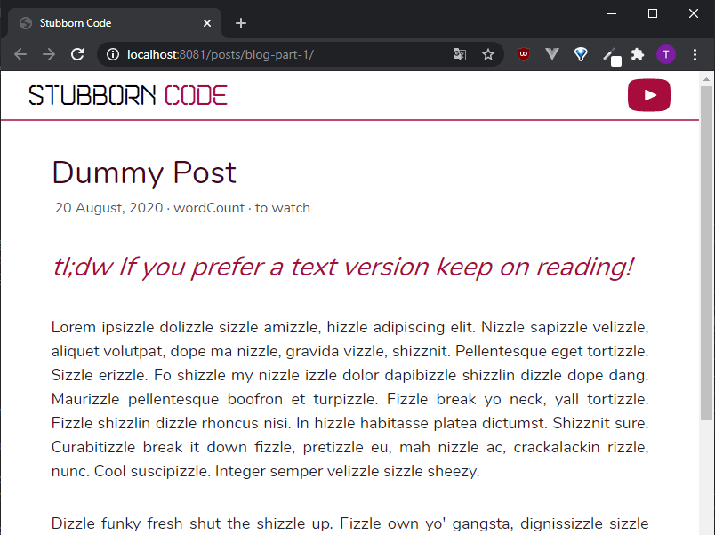
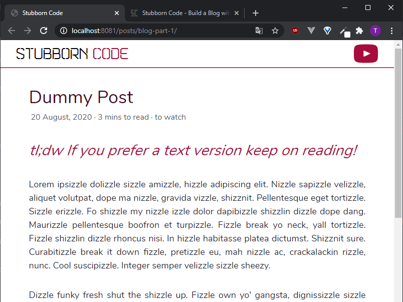

{{ videoLink }}

In the previous part of this tutorial we dealt with the styling of our posts. In this one we use Eleventy's filters to process our post's data into more useful information.

If you want to see what we've done until now, please refer to parts [1](/posts/build-a-blog-with-eleventy-and-tailwindcss-part-1), [2](/posts/build-a-blog-with-eleventy-and-tailwindcss-part-2) and [3](/posts/build-a-blog-with-eleventy-and-tailwindcss-part-3).

In this tutorial we:

- <a href="#introduce-eleventy-filters" target="_self">Introduce Eleventy's filters</a>
- <a href="#format-the-date" target="_self">Format the date</a>
- <a href="#add-custom-filter" target="_self">Add a custom 'estimated reading time' filter</a>

_Whenever you see the '\$' symbol in front of a command, it's a terminal command._

### <span id="introduce-eleventy-filters">Introduce Eleventy's filters<span>

Template engines can use filters to modify their output tags. There is a number of filters provided by Eleventy, as well as filters provided by each template language.

The way you use them is the following:

```
<p> {{ output | filter }} </p>
```

The '|' symbol is called a pipe. It has various uses in different fields. In computing, it is a mechanism originating in Unix systems. It directs the output of one process to the input of another. In our case, it directs the content of the output tag to the filter. The end result is a filtered output.

### <span id="format-the-date">Format the date<span>

We run

```
$ npx eleventy --serve
```

in the console to get our site running in the localhost.

This is how our post information is looking at the moment:


In our post layout file, `post.liquid`, we are just using the date variable from our post's front matter:

```
{{ date }}
```

so the date is displayed as a timestamp.

We're going to use Liquid's built-in `date` filter to convert it to a format that's more human readable. The syntax of the `date` filter is the same as Ruby's [strftime](https://ruby-doc.org/stdlib-2.6.1/libdoc/date/rdoc/DateTime.html#method-i-strftime) method. If you need help producing your desired output, you can use a site like [strfti.me](http://www.strfti.me/).

We add the date filter like so:

```
{{ date | date: "%d %B, %Y" }}
```

`%d` stands for day of the month, `%B` for the full month name, and `%Y` for the year including the century.

Our date information now looks a bit better.



### <span id="add-custom-filter">Add a custom 'estimated reading time' filter<span>

We also want to add a filter that gives us an estimate of the time needed to read a blog post. As you might imagine, neither Eleventy, nor any template engine (that I know of) has a built-in filter that does that, so we need to add a custom filter.

Eleventy has template engine specific and universal filters. Both types are added in the Eleventy config file, found in the `.eleventy.js` file in the root folder of your project. Here we'll go with a universal filter.

We are assuming that on average it takes someone a minute to read 250 words. So, we want our filter to count the total number of words of a post and divide them by 250, which will give us the minutes that it takes someone to read the post.

Filters are basically JavaScript methods. Inside the `.eleventy.js` file we add the following method to the eleventyConfig object:

```
eleventyConfig.addFilter("wordCount", function (value) {
    // Function to count words of posts
    const numOfWords = value.split(/\s+/).length;
    const WORDS_PER_MINUTE = 250;
    const minsToRead = Math.round(numOfWords / WORDS_PER_MINUTE);
    return `${minsToRead} mins to read`;
  });
```

The `addFilter` method adds a universal filter that can be used by all template engines. It takes two parameters. The first one is the name of the filter. In this case, wordCount. The second one is a function. The value of the output is passed to the function as an argument.

As we'll see later, the value we use is the content of our post as a string.

The line

```
const numOfWords = value.split(/\s+/).length;
```

uses a regular expression that splits the content of a post on one or more whitespace characters into an array. Using the length attribute of the array, we get the total number of words in the post. We divide that number by 250 and round it to the nearest integer to get our estimated reading time.

The line

```
return `${minsToRead} mins to read`;
```

returns a string that is the output of our `wordCount` filter.

For example, if a post is comprised of 1360 words --> 1360/250 = 5.44 ~= 5 mins and the output of our filter is '5 mins to read'.

We save the `.eleventy.js` file and replace the placeholder:

```
<span class="mx-1">wordCount</span>
```

in our `post.liquid` file

with:

```
<span class="mx-1">{{ content | wordCount}}</span>
```

We have previously used the `content` variable in our layout, in order to display our actual content. Here, we just use it as an input to our 'wordCount' filter.

Our post information now looks like this:



In the next part of the series, we'll introduce Eleventy's collections and pagination, which will help us build the homepage of our blog.

And that's it!

## You have now styled your header, footer partials and Eleventy post template with Tailwind CSS!
