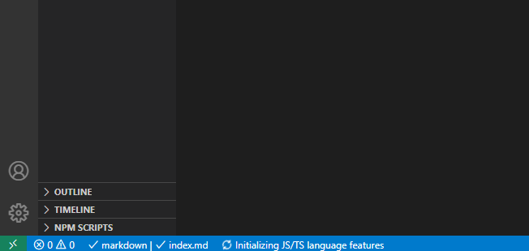
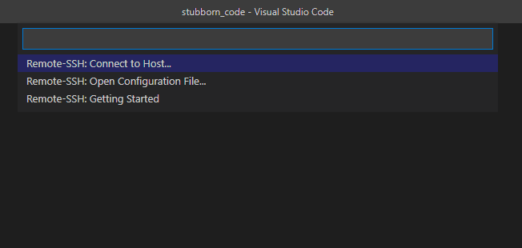
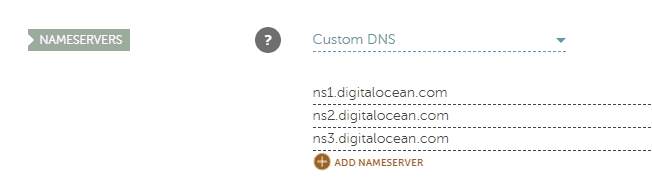
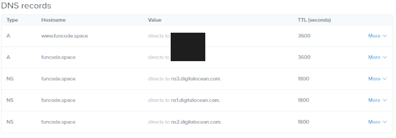

{{ videoLink }}

This tutorial shows you to code and deploy a simple Express.js app to Digital Ocean.

We:

- <a href="#install-node" target="_self">Install node.js</a>
- <a href="#setup-express" target="_self">Setup an Express.js app</a>
- <a href="#setup-pm2" target="_self">Setup PM2 process manager</a>
- <a href="#setup-ufw" target="_self">Setup ufw firewall on Ubuntu</a>
- <a href="#install-nginx" target="_self">Install and configure nginx</a>
- <a href="#setup-domain" target="_self">Setup a domain on Namecheap and Digital Ocean</a>
- <a href="#add-ssl" target="_self">Add an SSL certificate with Let's Encrypt</a>

_Whenever you see the '\$' symbol in front of a command, it's a terminal command._

If you haven't setup a Digital Ocean yet, [this tutorial](/posts/digital-ocean-basic-droplet-setup/) might be able to help you.

We are going to install nvm, which is a node version manager that makes the installation and management of different Node versions a breeze. You can find nvm's github repo [here](https://github.com/nvm-sh/nvm).

### <span id="install-node">Install node.js<span>

We connect to our droplet through SSH and use the following script to install nvm:

```
$ curl -o- https://raw.githubusercontent.com/nvm-sh/nvm/v0.35.3/install.sh | bash
```

After this is installed, we can either close and reopen our terminal, or run the command that the nvm script gave us to run it immediately.

We can now use:

```
$ nvm install node
```

to install the latest version of Node.

If we now run:

```
$ node -v
```

we should see something like:

```
v14.4.0
```

If we get a version number, we have successfully installed Node.

We can now write our basic Express app.

### <span id="setup-express">Setup an Express.js app</span>

In our console we run the following commands to create a directory, cd into it, initialize a node project (the -y flag accepts everything and gives us the default npm project configuration) and install Express:

```
$ mkdir express_server
$ cd express_server
$ npm init -y
$ npm install express
```

I'm using VS Code and I find it easier to connect through that using SSH in order to edit our project files.
If you also want to do that, you can get VS Code [here](https://code.visualstudio.com/) and the extension I use to connect remotely [here](https://marketplace.visualstudio.com/items?itemName=ms-vscode-remote.remote-ssh).

If you have installed VS Code and the remote SSH extension, you should now have a green icon in the bottom left corner of your screen as seen in this screenshot:



Clicking on that gives you the following options:



If you haven't used the extension before, you should probably configure it first, so click on Remote-SSH: Open Configuration File...

You get a configuration file similar to the one below:

```
# Read more about SSH config files: https://linux.die.net/man/5/ssh_config
Host alias_name_of_your_choice
    HostName IP_address_of_your_droplet
    User username_of_your_droplet_user
```

Set the options accordingly and click on the green icon of the extension once again, this time selecting the Remote-SSH: Connect to Host... and clicking on the host name you chose earlier.

After a few seconds you should be connected to your droplet. Open the express_server folder we created earlier, by clicking on the open folder button on the left sidebar of VS Code and create a new file named 'index.js' that has the following lines of code:

```
const express = require('express')
const app = express()

const port = 3000
app.listen(port, () => console.log(`Express app listening on port ${port}`))

app.get('/', (req, res) => {
    // This tells Express that we want to send HTML code
    // and not plain text
    res.setHeader('content-type', 'text-html')
    res.send('<h2>Hello from Stubborn Code</h2>')
})
```

Let's go through the lines of code that run our simple Express server.

We need to require 'express' and run it to get an app instance:

```
const express = require('express')
const app = express()
```

We are setting up a server on port 3000:

```
const port = 3000
app.listen(port, () => console.log(`Express app listening on port ${port}`))
```

We are listening for GET requests on the root URL of our domain:

```
app.get('/', (req, res) => {
    // This tells Express that we want to send HTML code
    // and not plain text
    res.setHeader('content-type', 'text-html')
    res.send('<h2>Hello from Stubborn Code</h2>')
})
```

We can now run save our file and use our terminal to run our server with:

```
$ node index.js
```

But that is blocking our terminal, so we need to find a better way...

### <span id="setup-pm2">Setup PM2 process manager</span>

Enter PM2.

PM2 is a process manager for Node applications that can run our server for us.

We install it by running:

```
$ npm install -g pm2
```

Where -g is a global flag that will install PM2 on our server globally.

We can now run our server with:

```
$ pm2 start index.js
```

Using:

```
$ pm2 list
```

we get a list of our PM2 apps. Using the value that is found under name, we can manage our app. In this case our app is listed as index.

We can use the following commands to manage our app:

```
$ pm2 stop index
$ pm2 start index
$ pm2 restart index
```

PM2 does not start apps automatically on system reboot. To make our app persistent we run the below command:

```
$ pm2 startup
```

This will give us a startup script that looks similar to the one below , which we can copy/paste and run in our terminal:

```
$ sudo env PATH=$PATH:/home/stubborn_code/.nvm/versions/node/v14.4.0/bin /home/stubborn_code/.nvm/versions/node/v14.4.0/lib/node_modules/pm2/bin/pm2 startup systemd -u stubborn_code --hp /home/stubborn_code
```

We also run:

```
$ pm2 save
```

to save our process list and our PM2 setup is done.

With our app running on port 3000, a user would need to explicitly specify that they want to send a GET request to our server on port 3000. In case of HTTP requests, traditionally it is expected to communicate on ports 80 and 443.

We can use nginx as a reverse proxy and forward requests from ports 80/443 to port 3000, our Express app port that we set before.

### <span id="setup-ufw">Setup ufw firewall on Ubuntu</span>

On top of that, since we are running Ubuntu's ufw firewall, we need to allow incoming requests on ports 80 and 443.

In order to allow incoming connections we run the following commands:

```
$ sudo ufw allow 80
$ sudo ufw allow 443
```

### <span id="install-nginx">Install and configure nginx</span>

Next is nginx.

We update Ubuntu's apt manager with:

```
$ sudo apt update
```

And install nginx with:

```
$ sudo apt install nginx
```

If the installation went fine, running:

```
$ systemctl status nginx
```

should show nginx as active.

We are now going to edit nginx's default configuration file to set it up as a reverse proxy:

```
$ sudo nano /etc/nginx/sites-available/default
```

Since it's a new installation we only have one server block.

Next to `server_name` we add our domain name, with and without www, which should look like:

```
server_name your_domain_name.com www.your_domain_name.com;
```

Under `location / {` we add:

```
proxy_pass http://localhost:3000;
```

Click ctrl-X to save and enter to exit the nano file editor.

We run

```
$ sudo nginx -t
```

To test if the configuration file is ok and we restart our nginx service with:

```
$ sudo service nginx restart
```

### <span id="setup-domain">Setup a domain on Namecheap and Digital Ocean</span>

We can now go to your web registrar and enter Digital Ocean's name servers.

I'm using NameCheap and I added the servers:

```
ns1.digitalocean.com
ns2.digitalocean.com
ns3.digitalocean.com
```

Under custom DNS in my domain's configuration.



If you just added the name servers, you should give it some time in order to propagate through the network. NameCheap stated that it can take up to 48 hours, but it actually took around 20 mins.

You also need to add your domain name in Digital Ocean.

That is done by clicking on 'Networking' on the left sidebar.

There you add your domain name and add two A records, one with '@' as your hostname and one with 'www' as your hostname, both directing to your droplet. This ensures that both `your_domain_name.com` and `www.your_domain_name.com` are included.

After this is done, your networking configuration should look similar to the one below.



### <span id="add-ssl">Add an SSL certificate with Let's Encrypt</span>

We are now ready to add our SSL certificate from [Certbot](https://certbot.eff.org/lets-encrypt/ubuntubionic-nginx).

In our console we add the Cerbot PPA:

```
$ sudo apt-get update
$ sudo apt-get install software-properties-common
$ sudo add-apt-repository universe
$ sudo add-apt-repository ppa:certbot/certbot
$ sudo apt-get update
```

Install Certbot:

```
$ sudo apt-get install certbot python3-certbot-nginx
```

Get and install our certificate:

```
sudo certbot --nginx
```

The installer will give us a few options.

We can activate HTTPS for both the non-www and the www names of our domain and redirect all HTTP traffic to HTTPS, removing HTTP access.

And that's it!

## You have now deployed a simple Node/Express.js App to a Digital Ocean droplet!
