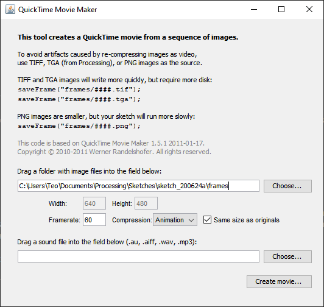
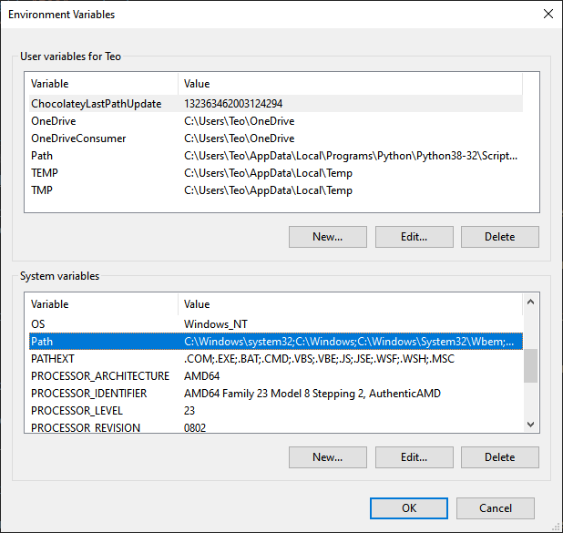

{{ videoLink }}

This tutorial shows you how to export images/movies from Processing and upload them to Instagram.

We:

- <a href="#use-save-function" target="_self">Use the Processing save() function to export a still frame of our sketch</a>
- <a href="#use-saveFrame-function" target="_self">Use the Processing saveFrame() function to export a sequence of frames from our sketch</a>
- <a href="#use-movie-maker" target="_self">Use Processing's Movie Maker tool to join our sequence of frames into a movie</a>
- <a href="#use-ffmpeg" target="_self">Use ffmpeg to produce a better movie of our animation</a>
- <a href="#use-developer-tools" target="_self">Use the developer tools to upload our image to Instagram</a>

You should already know the basics of [Processing](https://processing.org/), as this is not a full Processing tutorial, but you don't need to be an expert.

No matter how experienced you are, there is high chance that you want to share your creations with the world and this guide shows you exactly how to do that.

Since you want to export your media, the size of your canvas is important. There is no golden rule that gives you the best size as this depends on your use case.

In case of Instagram, you can go with the following formats for best results:

- Square(1:1) format --> 1080px by 1080px
- Portrait(4:5) format --> 1080px by 1350px
- Landscape(1.91:1) format --> 1080px by 608px

In any case, think how you want to use your exported graphics and adjust the [`size()`](https://processing.org/reference/size_.html) function accordingly.

Another important decision you want to make when it comes to animations, regards the frame rate and we will see how that comes into play when we talk about how we export a movie later in this guide.

### <span id="use-save-function">Use the Processing save() function to export a still frame of our sketch</span>

Exporting an image from Processing is straightforward and is done through its [`save()`](https://processing.org/reference/save_.html) function.

_It is important to note that you should save your project first, because the exported image is going to be saved in the folder that your saved project is in. Otherwise, the exported file is going to be saved in a temporary folder._

The code for our sketch is:

```
void setup() {
  size(700, 700);
  noStroke();
}

void draw() {
  background(255);
  fill(0);
  rect(0, height/2, width, height/2);
  fill(255);
  ellipse(width/2, height/2, 50, 50);
  translate(width/2, height/2);

  // Frame
  rotate(radians(90));
  for (int i = 0; i < 11; i++) {
    ellipse(i * 30, 0, 2 * i, 2 * i);
  }

  // Save a .png image of our sketch in
  // the folder that the sketch was saved in
  save("frame.png");
}
```

The `save()` function takes as a parameter the name of the image you want to export. You can also use a relative path to your saved project folder such as 'folder/filename' or absolute path that starts with '/' and save it anywhere on your computer.

If we run this sketch we get the image below:


and a file named 'frame.png' in the folder of our project. If we open the file, we will see the image mentioned above.

Simple as that.

### <span id="use-saveFrame-function">Use the Processing saveFrame() function to export a sequence of frames from our sketch</span>

Exporting an animation is not as straightforward.

Processing has a [`saveFrame()`](https://processing.org/reference/saveFrame_.html) function. As the name implies, it saves a sequence of frames, so we need to find a way to combine them into a movie.

_Once again, make sure that you have already saved your project to have easier access to your saved frames._

We are using the code below that gives us a short animation:

```
void setup() {
  size(700, 700);
  noStroke();
}

void draw() {
  background(255);
  fill(0);
  rect(0, height/2, width, height/2);
  fill(255);
  ellipse(width/2, height/2, 50, 50);
  translate(width/2, height/2);

  // Animation
  rotate(radians(frameCount));
  for (int i = 0; i < 11; i++) {
    if ( frameCount % 360 < 180) {
      fill(255);
    } else {
      fill(0);
    }
    ellipse(i * 30, 0, 2 * i, 2 * i);
  }
  if(frameCount == 180){
    noLoop();
  }
  saveFrame("frames/bw-###.png");
}
```

It is important to understand how two variables that Processing provides us, **frameRate** and **frameCount**, work.

The draw function is running in a loop. One loop cycle is equal to one frame. frameRate is fixed and has a default value of 60, so we have 60 frames and 60 executions of the draw function per second.

frameCount is a variable that has an initial value of 1 and is increased by 1 every time the draw function is executed.

Since,

```
rotate(radians(frameCount));
```

is using frameCount as a variable and

```
rotate(radians(360))
```

would give us a full rotation, with the default frameRate of 60 this would take 360/60 = 6 seconds.

The lines:

```
if(frameCount == 180){
    noLoop();
  }
```

ensure that the loop is going to run until the frameCount is 180, which means 180/60 = 3 seconds.

The `saveFrame()` function runs each time the `draw()` function is executed and saves a frame of our sketch's current state.

Here:

```
saveFrame("frames/bw-###.png");
```

we are using a relative path, which will create a folder named 'frames' in our project folder that will contain 180 images, one for each frame of our animation. Every file will begin with 'bw-' as we specified and the hash symbols will be replaced by the current value of frameCount. The number of hash symbols will specify the maximum amount of files that can be saved, which in this case would be 999.

If we run this sketch, we get the below Processing animation:

<video class="m-auto my-4" width="700" height="700" controls>
  <source src="vid/out.mp4" type="video/mp4">
</video>

And 180 images in our 'frames' folder.

Now, we need to combine them into a movie.

### <span id="use-movie-maker">Use Processing's Movie Maker tool to join our sequence of frames into a movie</span>

The first and easier way is to use the Movie Maker program, which can be found in the 'Tools' menu of Processing.



We just choose the folder that contains our exported frames, click on 'Create movie', choose our desired frame rate, which should be 60 if we want to match our previous sketch frame rate, give our movie a filename and we get a Quicktime .mov file.

However, it is not my preferred way. It is not very flexible and gives us a file that has a few compatibility issues such as the native Windows player not being able to read it.

### <span id="use-ffmpeg">Use ffmpeg to produce a better movie of our animation</span>

This is why I use a popular console software, [FFmpeg](https://ffmpeg.org/). FFmpeg is a free project that consists of libraries and programs for handling video, audio, and other multimedia files and streams.

In order to use FFmpeg you need a terminal emulator. I'm on Windows and I'm using [cmder](https://cmder.net/). You can use that if you're on Windows, or use the native terminal app if you're on a Mac, or a Linux computer.

FFmpeg only provides source code, but you can get pre compiled builds on its website.

After you've installed the appropriate build based on your operating system, you can also add it to your path.

That simply means that you can run FFmpeg in your console from any directory.

In order to do that in Windows 10, click on the start button and start typing 'environment', until 'Edit the system environment variables' appears. Click on it when it does!

When you see the below window, click on 'Environment Variables'.


Under system variables, select 'Path' and click on 'Edit'



Click on 'Browse', locate the folder where you installed FFmpeg in and select the 'bin' folder inside that, since that is where the FFmpeg executable resides in.


After you've added the FFmpeg folder, keep clicking ok until you get rid of all the windows that are open.

You can now use FFmpeg from any directory in your terminal.

Using the terminal of your choice, `cd` (change directory) into the 'frames' directory that we created earlier.

The FFmpeg command we use is the one below:

```
$ ffmpeg -r 60 -i bw-%03d.png -c:v libx264 -pix_fmt yuv420p movie.mp4
```

While this is not a terminal tutorial, it helps to have a basic understanding of how commands usually work.

We start with the name of the command that we want to use. Here being ffmpeg. The parts that start with a '-' symbol are called flags. Depending on the flag, they sometimes accept a value next to them. You can think of them as options that the command accepts.

Specifically in the FFmpeg command, we have global options, input file name and input file options, output file name and output file options.

The -i flag specifies the input file. Left to that we only use the -r flag with 60 as its value. This means that we want the frame rate of the input file to be 60, to match our Processing animation. The value 'bw-%03d.png' means that we have a sequence of files that begin with 'bw-' and end with '.png'. The middle '%03d' part means that our sequence of input files is using decimal numbers composed of three digits padded with zeros.

movie.mp4 is the name of choice for our output file and between that and our input file name are the output options.

The '-c:v' flag specifies the video codec of the output file, which we set as libx264. The 'pix_fmt' flag denotes the pixel format that we set to be 'yuv420p' in order to accommodate outdated media players.

When we run the command we get the 'movie.mp4' file inside our 'frames' folder.

### <span id="use-developer-tools">Use developer tools to upload our image to Instagram</span>

If we want to upload our wonderful image to Instagram, we can do so using a desktop computer or traditionally using a mobile phone. On a desktop computer, we can use any modern browser. The way we do that is access its developer tools, usually pressing F-12, toggling the device toolbar and selecting a mobile device. When you now visit [Instagram](https://instagram.com), it will seem like you are using a mobile device and you can upload your image as if you were doing it from a mobile phone.

Unfortunately, this method does not work for videos, so we first need to transfer the video to a phone and upload it from there.

And that's it!

## You have now exported an image and a movie from Processing!
