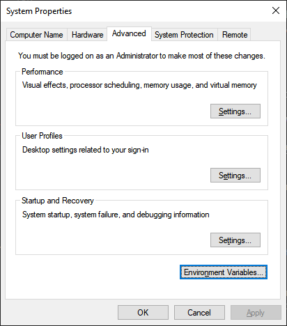
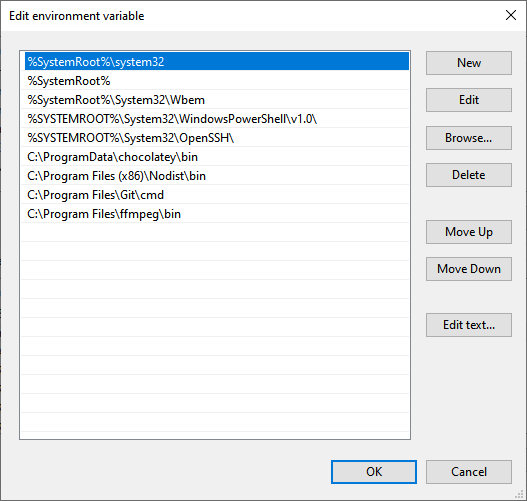

{{ videoLink }}

This tutorial shows you how to export images/animations from p5.js

We:

- <a href="#use-save-function" target="_self">Use the p5.js save() function to export a still frame of our sketch</a>
- <a href="#use-ccapture-webm" target="_self">Use the ccapture.js library to export a webm file of our animation</a>
- <a href="#use-ccapture-sequence" target="_self">Use the ccapture.js library to export a sequence of png files of our animation</a>
- <a href="#install-ffmpeg" target="_self">Install ffmpeg and add it to our Windows path</a>
- <a href="#use-ffmpeg-webm" target="_self">Use ffmpeg to convert our webm file to an mp4 file</a>
- <a href="#use-ffmpeg-sequence" target="_self">Use ffmpeg to join our sequence of png images to an mp4 file</a>

p5.js is JavaScript library, which serves as a version of Processing for the web. This comes with the obvious advantage that it runs in the browser and makes it easy to share your creations with the world. However, it also makes it a bit trickier to work with exporting files compared to Processing.

Since you want to work with files, you need to decide on two things depending on your use case. The size of your canvas and the frame rate if you're exporting an animation.

Think of how you want to use your exported image and adjust the size of your canvas through the [`createCanvas()`](https://p5js.org/reference/#/p5/createCanvas) function.

### <span id="use-save-function">Use the p5.js save() function to export a still frame of our sketch</span>

We can export a still frame using the [`save()`](https://p5js.org/reference/#/p5/save) function.

_It is important to note that if your draw() function is looping, the save() function will open a save dialog every frame, so make sure that if your sketch is looping, you stop it from looping first, for example with the [`noLoop()`](https://p5js.org/reference/#/p5/noLoop) function._

The code for our sketch is:

```
const letters = ["C", "D", "E", "O"];

function setup() {
  createCanvas(700, 700);
  frameRate(5);
}

function draw() {
  background(20);
  for (let y = 0; y <= height; y += 40) {
    for (let x = 0; x <= width; x += 40) {
      push();
      translate(x, y);
      fill(random(255), random(255), random(255), random(255));
      text(random(letters), 0, 0);
      pop();
    }
  }
  noLoop();
  save("myImage.png");
}
```

We are using the `noLoop()` function in order to stop our sketch from animating and the last line is saving our image. The `save()` function takes an optional parameter, which is the name of the file that we want to save, in this case 'myImage.png'. If we don't pass an argument, the file is saved as 'untitled.png'. When we save our file and run the HTML file that is loading our script, a file named 'myImage.png' is saved in our browser downloads folder.

### <span id="use-ccapture-webm">Use the CCapture.js library to export a webm file of our animation</span>

p5.js can only save up to 15 frames with its [`saveFrames()`](https://p5js.org/reference/#/p5/saveFrames) function. In order to get all desired frames, we use an external canvas capture library, [ccapture.js](https://github.com/spite/ccapture.js/).

We can either install the package through npm, or download the whole pack. Here, I downloaded a minified version of the library through its GitHub repo and included it in our HTML file in the usual way:

```
<script src="CCapture.all.min.js"></script>
```

The code of our animation sketch is:

```
const letters = ["C", "D", "E", "O"];

const capturer = new CCapture({
  framerate: 5,
  format: "webm",
  name: "movie",
  quality: 100,
  verbose: true,
});

let p5Canvas;

function setup() {
  p5Canvas = createCanvas(1080, 1080);
  frameRate(5);
}

function draw() {
  if (frameCount === 1) capturer.start();
  background(20);
  for (let y = 0; y <= height; y += 40) {
    for (let x = 0; x <= width; x += 40) {
      push();
      translate(x, y);
      fill(random(255), random(255), random(255), random(255));
      text(random(letters), 0, 0);
      pop();
    }
  }
  capturer.capture(p5Canvas.canvas);
  if (frameCount === 30) {
    noLoop();
    capturer.stop();
    capturer.save();
    }
}
```

We are creating a CCapture instance using a number of options with:

```
const capturer = new CCapture({
  framerate: 5,
  format: "webm",
  name: "movie",
  quality: 100,
  verbose: true,
});
```

We have set a frame rate of 5 seconds per second, so it is important to match that in our capturer options with `framerate: 5`. We want to export a .webm video, which is an audiovisual media file format, primarily used on the web. `name: 'movie'` results to a file named 'movie.webm'. The quality option goes from 1 to 100, 1 being the worst and 100 being the best. Lastly, if we set the verbose option to true, we get information about the capture in our developer tools console.

```
let p5Canvas;
p5Canvas = createCanvas(1080, 1080);
```

These lines save a reference to our canvas, which we need to pass our capturer later on.

In order to start the capture we use the line below:

```
if (frameCount === 1) capturer.start();
```

We just want to execute the `start()` method of our capturer only at the beginning of our animation, which is done by checking the frame count of the animation.

```
capturer.capture(p5Canvas.canvas);
```

The `capture()` method of our capturer is capturing our canvas every frame. _Note that we need to pass the canvas attribute of our canvas reference that we saved earlier._

```
if (frameCount === 30) {
    noLoop();
    capturer.stop();
    capturer.save();
}
```

Lastly, since we check for a count of 30 frames, we save 6 seconds of our animation. 30 frames / 5 frames per second = 6 seconds. The `noLoop()` function stops looping, the `stop()` method stops the capture procedure and the `save()` method is saving the frames that our capturer has captured until now. If we now run our HTML file, after a few seconds we get a file named 'movie.webm' in our downloads folder.

ccapture can also export files in gif, png, jpg and ffmpegserver formats.

### <span id="use-ccapture-sequence">Use the CCapture.js library to export a sequence of png files of our animation</span>

It might be useful to have our frames in .png format, so in order to do that we need to make a few adjustments to the options we pass when you create our CCapture instance as below:

```
const capturer = new CCapture({
  framerate: 5,
  format: "png",
  name: "zipped_movie",
  quality: 100,
  verbose: true,
});
```

We change the format option to 'png' and the filename to 'zipped_movie'. If we run our file again, we get a file named 'zipped_movie.tar' that contains our images. A tar file is an archive file created by tar, a standard format in the unix/linux world. In order to extract the file you can either use a terminal or a GUI software, such as [7-zip](https://www.7-zip.org/).

When you extract the files, you should see a sequence of images named '0000000.png', '0000001.png' and so on.

In order to manipulate our previously exported .webm file, or our .png sequence we can use FFmpeg.

FFmpeg is a console software that manipulates multimedia files. On Windows, you can run it using [cmder](https://cmder.net/) or any other terminal emulator. On Mac or Linux, you can use the native terminal app.

You can get a pre compiled FFmpeg build on its [website](https://ffmpeg.org/).

After you've installed the appropriate build based on your operating system, you can also add it to your path.

That simply means that you can run FFmpeg in your console from any directory.

In order to do that in Windows 10, click on the start button and start typing 'environment', until 'Edit the system environment variables' appears. Click on that.

When you see the below window, click on 'Environment Variables'.



Under system variables, select 'Path' and click on 'Edit'


Click on 'Browse', locate the folder where you installed FFmpeg in and select the 'bin' folder inside that, since that is where the FFmpeg executable resides in.



After you've added the FFmpeg folder, keep clicking ok until you get rid of all the windows that are open.

You can now use FFmpeg from any directory in your terminal.

This is not a terminal tutorial, so you should be already familiar with it, but if you just know how the `cd` command works that is used to change directories, you should probably be fine.

You can now `cd` into the folder that contains our '.webm' file.

### <span id="use-ffmpeg-webm">Use ffmpeg to convert our webm file to an mp4 file</span>

While '.webm' is a media format that modern browsers will have no problem reproducing, outdated media players are not going to be able to play the file, so if you want a file format that is more compatible, you can use FFmpeg to convert our '.webm' file to a more accessible '.mp4' file.

In the folder that contains our '.webm' file, we run the following command.

```
ffmpeg -i movie.webm movie.mp4
```

We are just using an -i flag that we give a value of 'movie.webm' that is the name of our movie file and 'movie.mp4', which is the desired name of our output file. After a second or two, we get our '.mp4' file.

### <span id="#use-ffmpeg-sequence">Use ffmpeg to join our sequence of png images to an mp4 file</span>

Joining a sequence is a bit more complicated. In the folder that contains our images we run:

```
ffmpeg -r 5 -i %07.png -pix_fmt yuv420p movie.mp4
```

FFmpeg can use global options, options for the input stream and options for the output stream, which go to the left of each stream.

The -r flag denotes the frame rate of our input. In the case of the '.webm' file, FFmpeg could deduce our desired input frame rate since we had a video file. Now, since we are only providing images FFmpeg has no way of knowing the desired frame rate. The -i flag marks our input. '%07d.png' means that we have a sequence of png files that is using decimal numbers composed of seven digits padded with zeros. The -pix_fmt flag sets the pixel format to yuv420p instead of the default yuv444p, making our mp4 file readable by outdated media players.

After we run the command we get our mp4 file that we can share with the rest of the world!

And that's it!

## You have now exported an image and a movie from p5.js!
